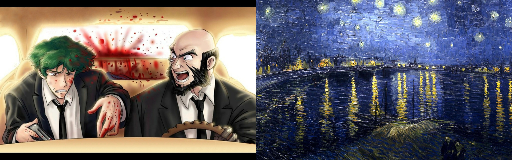
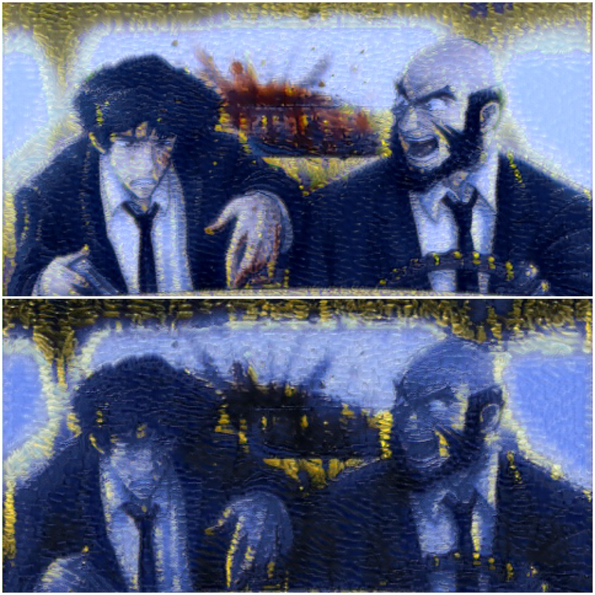
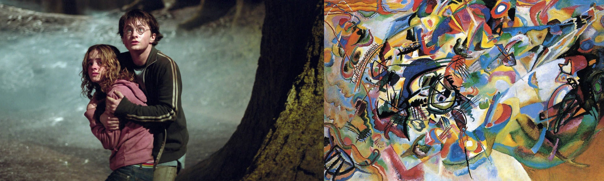
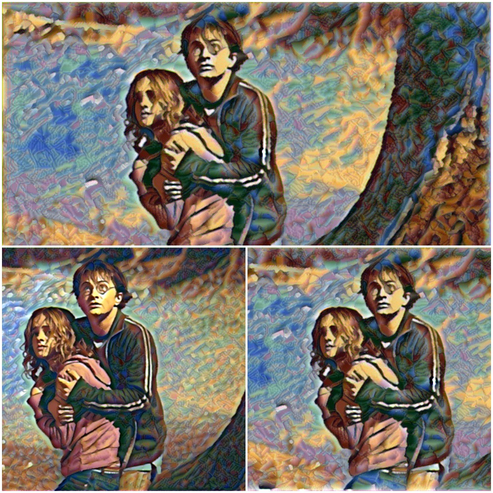
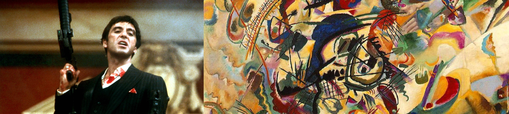
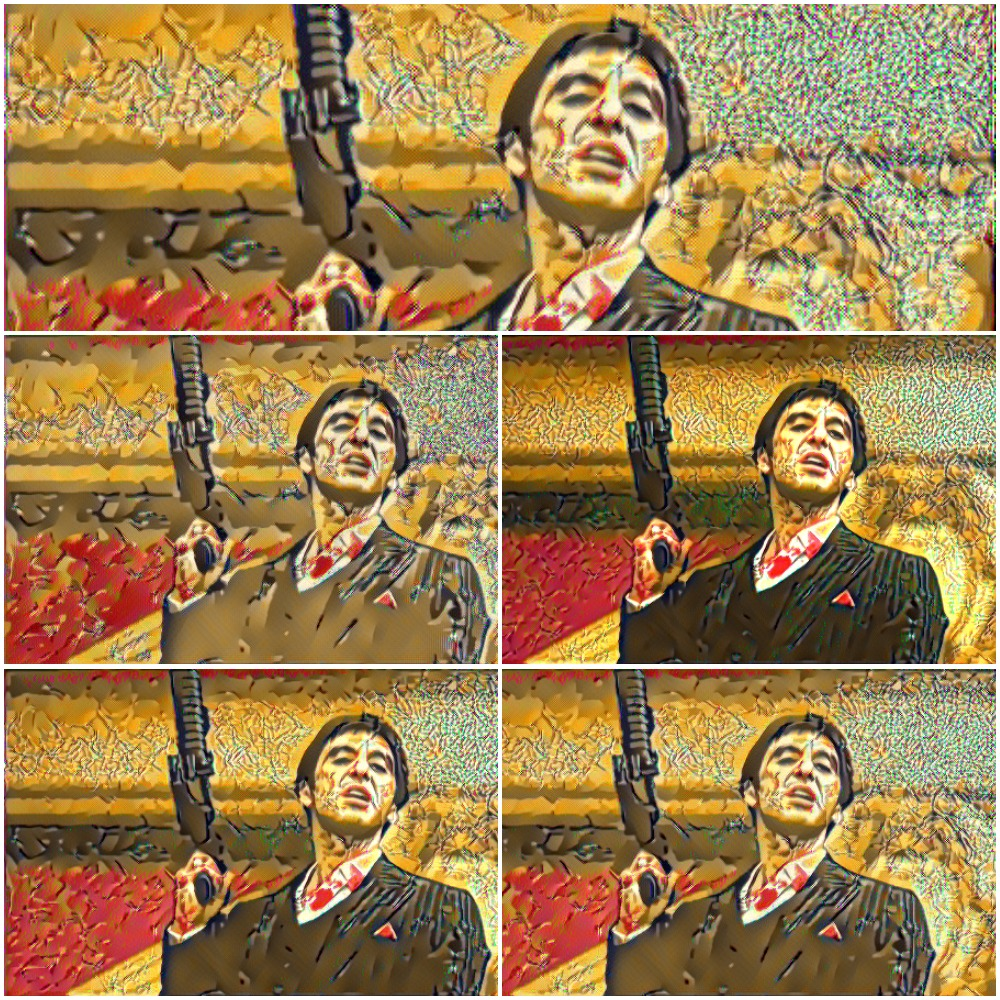
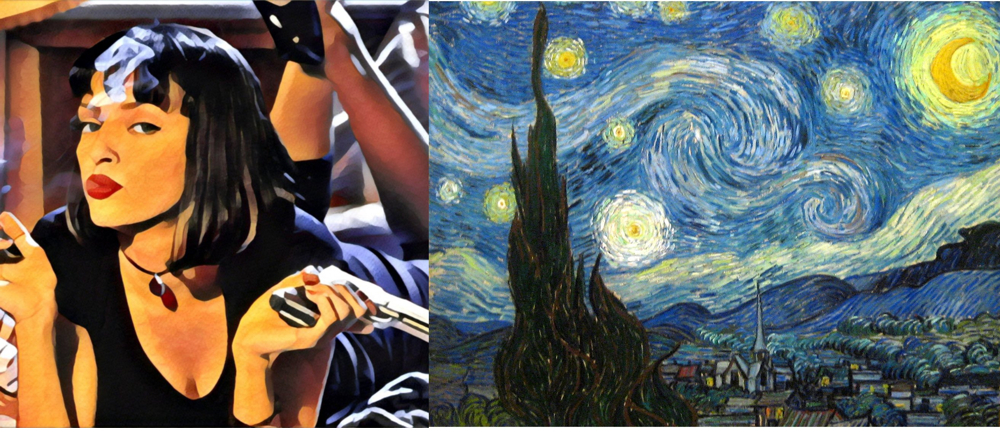
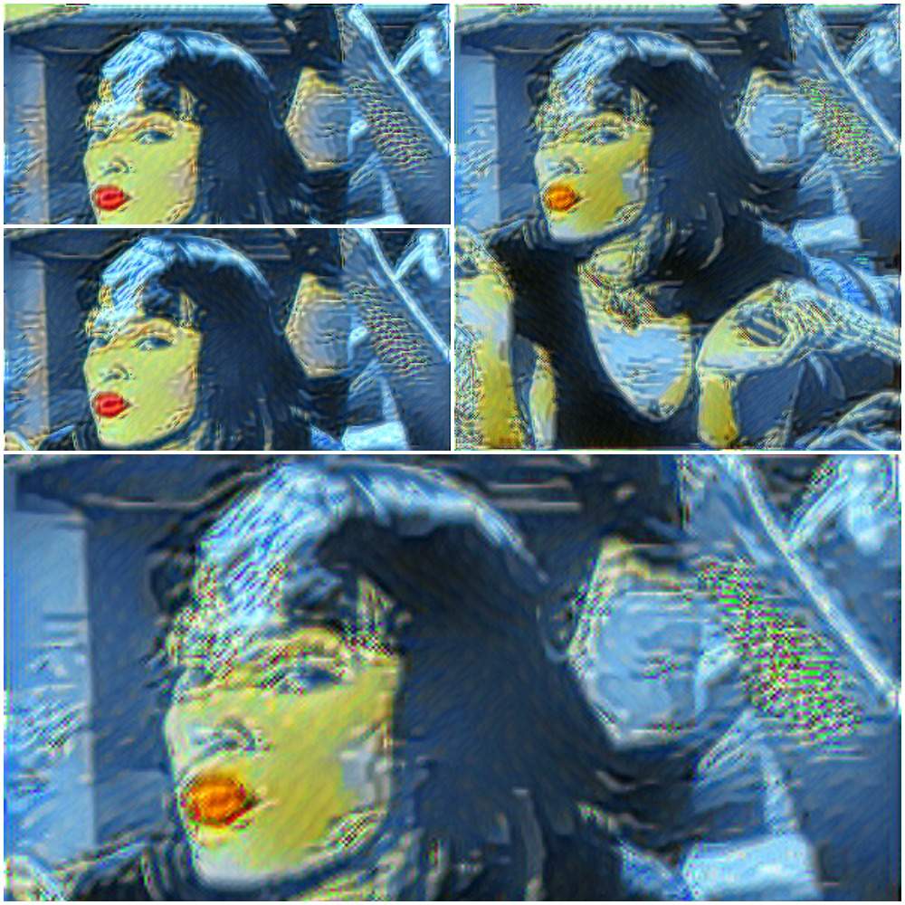

This post contains some outputs after applying neural style transfer techniques on them.

IPython notebook can be found [here](https://github.com/Parasgupta44/DL_Notebooks/blob/master/Neural_Style.ipynb).

> Neural style transfer is an optimization technique used to take some images, a content image, a style reference image (such as an artwork by a famous painter) and blend them together such that the content image is transformed to look still like the content image, but “painted” in the style of the style image.

## Examples

### Cowboy Bebop / Pulp Fiction / Starry Night Over the Rhône (Vincent van Gogh)

### Azkaban / Wassily Kandinsky's Composition VII

### Al Pacino / Wassily Kandinsky's Composition VII

### Pulp Fiction / The Starry Night (Vincent van Gogh)

